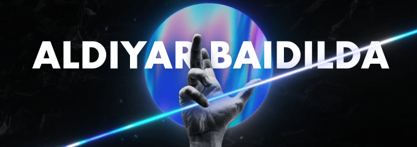
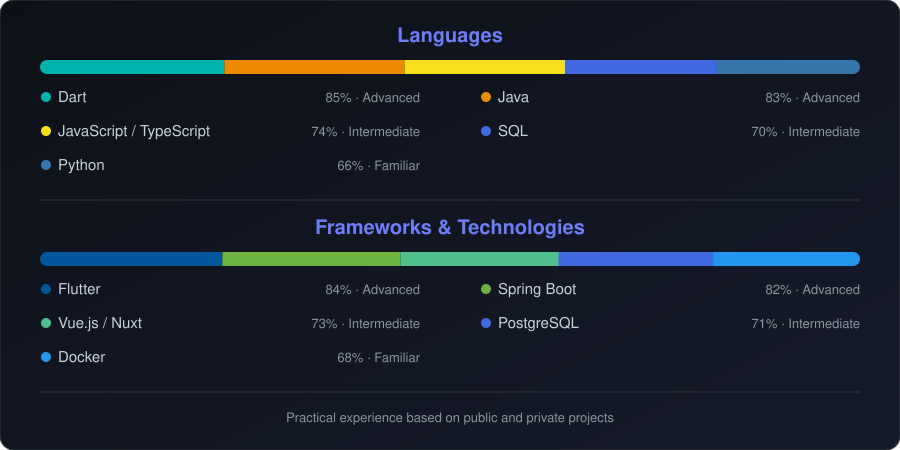

  

<table>
<tr>
<td width="60%" valign="top">

### About

Full-stack developer building mobile apps, backend systems, and web interfaces. I work across the entire product lifecycle — from architecture and API design to the final user experience and deployment.

  

  

---

### Currently working on

- 🧠 **[BalancePsy.com](https://balance-psy.com/)** — a mental-health platform I'm building across mobile, backend, and web
- ☁️ **[NomadCloud.kz](https://nomadcloud.kz/)** — cloud solutions
- ⚙️ **Veya** — my own full-stack product: separate mobile, backend, and web apps

### Featured project — Veya

| Layer | Stack |
|---|---|
| 📱 Mobile | Flutter, Dart |
| ⚙️ Backend | Java, Spring Boot, PostgreSQL |
| 🌐 Web | Vue.js, Nuxt |
| 🐳 Infra | Docker, Ubuntu, GitHub |

---

### Engineering Interests

- Full-stack product development
- Mobile architecture and cross-platform apps
- REST API and backend architecture
- Database design
- UI/UX and accessible interfaces
- Docker-based development environments
- Testing, security, and maintainable code

---

</td>
<td width="40%" valign="top" align="center">

  

</td>
</tr>
</table>

---

<i>ninja mode: </i>

